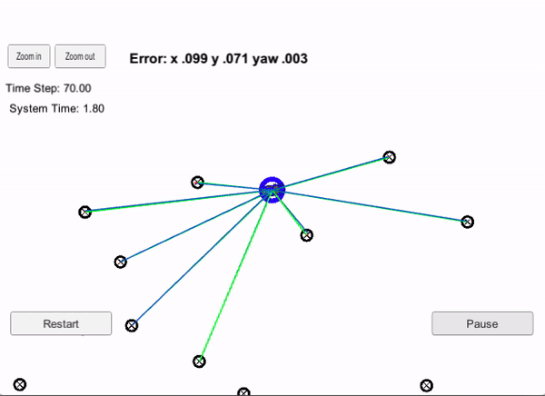

# Overview
This repository contains a working implementation of a 2-dimensional particle filter in C++, which is part of Udacity's Self Driving Car Engineer Nanodegree.



The particle filter is used with the Term 2 Simulator which can be downloaded [here](https://github.com/udacity/self-driving-car-sim/releases). The filter is given a map and some initial localization information (analogous to what a GPS would provide). At each time step the filter also gets observation and control data. Using this, the particle filter estimates the state of the robot.

# Particle filter implementation
The directory structure of this repository is as follows:

```
root
|   build.sh
|   clean.sh
|   CMakeLists.txt
|   README.md
|   run.sh
|   particle_filter.gif
|
|___data
|   |   
|   |   map_data.txt
|   
|   
|___src
    |   helper_functions.h
    |   main.cpp
    |   map.h
    |   particle_filter.cpp
    |   particle_filter.h
    |   Eigen
```

The file `particle_filter.cpp` in the `src` directory contains the code which was implemented by me as part of this assignment. 

### particle_filter.cpp

Upon each new measurement received by the simulater, the following 

#### Intitialization
If the measurement received is the first one, the particle filter is initialized using `ParticleFilter::init`. This method generates a specified number of particles, and which are initialized to the initial noisy estimate of x, y, theta with random gaussian noise added to each particle. 

#### Prediction
The method `ParticleFilter::prediction` updates the state of each particle based on control inputs and adds random Gaussian noise to each particle state.

#### Weight updates
After predicting the state of each particle, we need to compute the weight (proportional to the probability) of each particle state given the measurement (observation of landmarks). 

`ParticleFilter::updateWeights`  does the following:

* For each particle, computes the observed landmarks' map coordinates given the state of the particle: `observations_m`.
* From the map and the particle state, creates a vector of all map landmarks which are within sensor range of the particle `predicted_obs`.
* Does a pairwise comparison of the elements in `predicted_obs` and `observations_m` to find the closest located predicted landmark for each observation.   
* Computes the probability of the observation given the state of the particle by assuming gaussian sensor noise with zero mean.
* Updates the weight of the particle with the above probability.

#### Resampling

Resamples particles with replacement with probability proportional to their weight.

# Running the Code


This repository includes two files that can be used to set up and install uWebSocketIO for either Linux or Mac systems. For windows you can use either Docker, VMware, or even Windows 10 Bash on Ubuntu to install uWebSocketIO.

Once the install for uWebSocketIO is complete, the main program can be built and ran by doing the following from the project top directory.

1. mkdir build
2. cd build
3. cmake ..
4. make
5. ./particle_filter

Alternatively some scripts have been included to streamline this process, these can be leveraged by executing the following in the top directory of the project:

1. ./clean.sh
2. ./build.sh
3. ./run.sh

Tips for setting up your environment can be found [here](https://classroom.udacity.com/nanodegrees/nd013/parts/40f38239-66b6-46ec-ae68-03afd8a601c8/modules/0949fca6-b379-42af-a919-ee50aa304e6a/lessons/f758c44c-5e40-4e01-93b5-1a82aa4e044f/concepts/23d376c7-0195-4276-bdf0-e02f1f3c665d)

Note that the programs that need to be written to accomplish the project are src/particle_filter.cpp, and particle_filter.h

The program main.cpp has already been filled out, but feel free to modify it.

Here is the main protocol that main.cpp uses for uWebSocketIO in communicating with the simulator.

INPUT: values provided by the simulator to the c++ program

// sense noisy position data from the simulator

["sense_x"]

["sense_y"]

["sense_theta"]

// get the previous velocity and yaw rate to predict the particle's transitioned state

["previous_velocity"]

["previous_yawrate"]

// receive noisy observation data from the simulator, in a respective list of x/y values

["sense_observations_x"]

["sense_observations_y"]


OUTPUT: values provided by the c++ program to the simulator

// best particle values used for calculating the error evaluation

["best_particle_x"]

["best_particle_y"]

["best_particle_theta"]

//Optional message data used for debugging particle's sensing and associations

// for respective (x,y) sensed positions ID label

["best_particle_associations"]

// for respective (x,y) sensed positions

["best_particle_sense_x"] <= list of sensed x positions

["best_particle_sense_y"] <= list of sensed y positions


The code implemented in `particle_filter.cpp` outputs the following success message when run with the Term 2 Simulator:

```
Success! Your particle filter passed!
```

# Particle filter implementation
The directory structure of this repository is as follows:

```
root
|   build.sh
|   clean.sh
|   CMakeLists.txt
|   README.md
|   run.sh
|   particle_filter.gif
|
|___data
|   |   
|   |   map_data.txt
|   
|   
|___src
    |   helper_functions.h
    |   main.cpp
    |   map.h
    |   particle_filter.cpp
    |   particle_filter.h
    |   Eigen
```

The file `particle_filter.cpp` in the `src` directory contains the code which was implemented by me as part of this assignment. 
